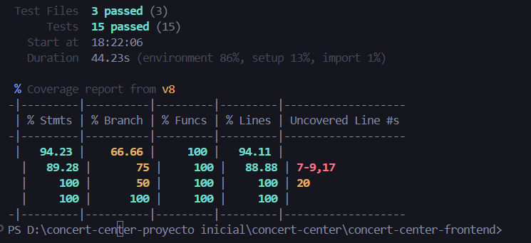
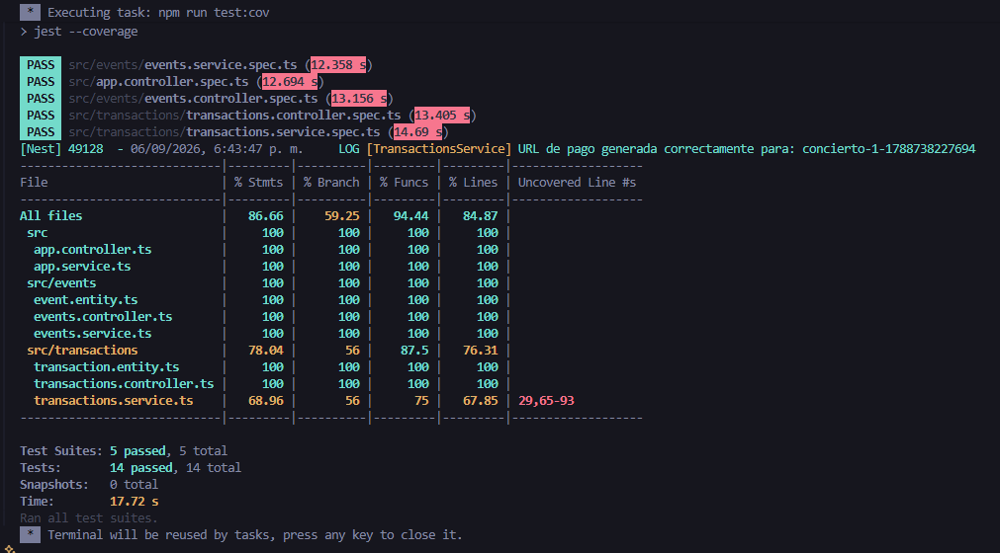

# Concert Center

Aplicación FullStack para la compra de boletas de conciertos con pagos en línea mediante Wompi (Sandbox UAT). Incluye un flujo completo de 5 pasos (Producto -> Datos -> Resumen -> Resultado -> Volver a tienda) y actualización de stock.

## Tecnologías
- **Frontend:** React, Redux Toolkit (Manejo de estado) , Vite(Build tool), Tailwind CSS (Estilos)
- **Backend:** NestJS, TypeORM, SQL.js(Base de datos portátil)
- **Integración:** Wompi API (Checkout Web en entorno UAT)

## Despliegue
- **Frontend (Vercel):** https://concert-center.vercel.app
- **Backend (Railway):** https://concert-center-production.up.railway.app

## 📂 Estructura del Proyecto

Este repositorio está estructurado como un Monorepo. Puedes encontrar instrucciones específicas de configuración y ejecución en:

- [Backend README](./concert-center-backend/README.md)
- [Frontend README](./concert-center-frontend/README.md)

## Modelo de Datos
- Se utilizó **SQL.js** (base de datos SQL portable en archivo) para garantizar la ejecución local sin dependencias externas.
- **Event:** (id, name, description, price, stock, style, image, featured)
- **Transaction:** (id, reference, status, amount, customer_email, wompi_transaction_id, eventId, quantity)

## Tests
- **Frontend:** 15 tests con Vitest. Cobertura >94% en líneas.

- **Backend:** 14 tests con Jest. Cobertura >84% en líneas.


## Seguridad
- Las llaves privadas y secretas de integración de Wompi se manejan exclusivamente en variables de entorno (`.env`), las cuales están protegidas en `.gitignore` y no se suben al repositorio.
- Configurado en Railway (Backend) y Vercel (Frontend).

## Repositorio
- **GitHub:** https://github.com/Leo952612/concert-center

 ## Sube el cambio a GitHub:
   ```bash
   git add .
   git commit -m "Docs: Reemplazar README genérico por documentación del backend"
   git push origin main